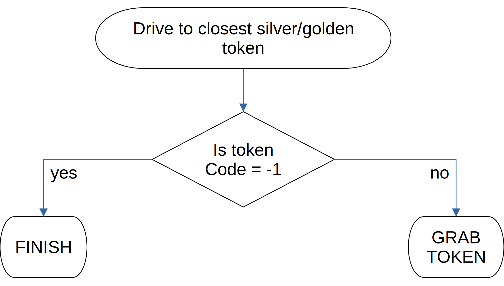
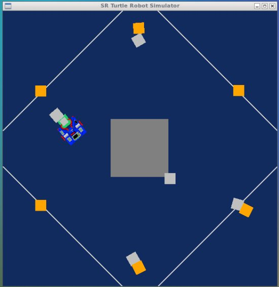

Exercise on Python Robotics Simulator
=====================================
This exercise is part of Research Track I course and its aim is to implement a simple program in Python to sort in a given order a group of tokens.  
The exercise is based on portable robot simulator developed by [Student Robotics](https://studentrobotics.org). Informations about the environment, how to set it up and references for the robot API can be found [here](./robot-sim/README.md).  
A description of the problem and the proposed solution are presented and explained in the following sections.

Installing and running
----------------------
Clone the branch assignment1 from the repository

```
>> git clone -b assignment1 https://github.com/davideCaligola/researchTrack1.git
```

Move into researchTrak1/robot-sim folder and launch the assignment file as follows:

```
>> cd researchTrack1/robot-sim
>> python2 ./run.py ./assignment.py

```
After the program driving the robot finishes, press CTRL+c to terminate also the file launcher run.py.

# Introduction
The robot is positioned in an area with golden and silver token. The goal is to bring each silver token close to a different golden token, so that each silver token will be coupled with a golden token.

<table>
  <tr>
    <td>
      
      <p>Initial state</p>
    </td>
    <td>
      
      <p >Possible ending state</p>
    </td>
  </tr>
</table>


## Proposed solution
--------------------
The problem has been solved based on the following state machine:


<font size="2"> Complete program state machine </font>

The state machine, if there are not any error while working, keeps running until each silver token is coupled with a golden token.
The following subsections describe the implementation of each state.

### GO TO SILVER / GO TO GOLD
The two states have the same core functionality implementation and differiantiate just because of two parameters: the token type (```MARKER_TOKEN_SILVER``` / ```MARKER_TOKEN_GOLD```) and the linear distance threshold, which specifies when the robot is considered close enough to the target.  
In case of closing to a silver token, the robot should be close enough to grab the token.  
In case of closing to a golden token, the robot should keep a greater distance from the target, considering that it is helding a silver token in front.  
The movement of the robot toward a token within a defined distance and orientation threshold is implemented according to the following flow diagram:



<font size="2"> Drive to token function diagram </font>

Drive to token is a wrapper function around the funtion ```drive_to_closest_token_with_type```, parameterized with respect to token type, list of token already handled, linear distance threshold, orientation distance and speed.  
It is implemented according to the following flow diagram


<font size="2"> Drive to closest token diagram</font>

The function implementing the find closest not already handled token per type is described byt the following flow diagram


<font size="2"> Find the closest not already handled token diagram</font>

### GRAB_TOKEN
This state performs the action of grabbing the silver token. It uses the method ```grab()```, part of the Robot API.  
After grabbing the silver token, the state moves to ```UPDATE_SILVER_LIST```.

### UPDATE_SILVER_LIST
This state is used to update the list of already grabbed silver token with the code of the just grabbed silver token.

```
silver_token_done.append(code_silver)
```

After appending the token to the list, it directly moves to GO TO GOLD state

### GO TO GOLD
As previously mentioned, this state uses the same functions as ```GO TO SILVER```, changing the parameter token type (set to  ```MARKER_TOKEN_GOLD```) and the linear distance threshold, increased to 0.5.  
Once the robot reaches the golden token within the linear distance threshold, it changes state to ```RELEASE_SILVER```.

### RELEASE SILVER
This state performs the release of the silver in proximity of a golden token. It uses the method ```release()```, part of the Robot API.  
After releasing the silver token, the state moves to ```UPDATE_GOLD_LIST```

### UPDATE GOLD LIST
This state is used to update the list of already coupled golden tokens with the code of the golden token the silver has been released close to.

```
gold_token_done.append(code_gold)
```

After appending the golden token code to the list, it directly moves to the state ```GO_TO_SILVER```.

## Helper functions
### rotate
Rotates the robot around its axis.    
Inputs:

* `(float) speed`: percentage of speed applied to the robot wheels
* `(float) seconds`: time in seconds the robot rotates.

The function applies:
```
R.motors[0].m0.power = -speed
R.motors[0].m1.power = speed
```
After the time specified by `seconds`, both motors power are set to 0.

### turnLeft / turnRight
Turn the robot while driving toward a token.  
Inputs:

* `(float) speed`: percentage of speed applied to the robot wheels
* `(float) seconds`: time in seconds the robot rotates.

The function applies to turn left:
```
R.motors[0].m0.power = 0
R.motors[0].m1.power = speed
```
and to turn right
```
R.motors[0].m0.power = speed
R.motors[0].m1.power = 0
```

After the time specified by `seconds`, both motors power is set to 0.

### drive
Moves forward the robot.  
Inputs:

* `(float) speed`: percentage of speed applied to the robot wheels
* `(float) seconds`: time in seconds the robot rotates.

The function applies:
```
R.motors[0].m0.power = speed
R.motors[0].m1.power = speed
```
After the time specified by `seconds`, both motors power is set to 0.

### retreat_from_token
Retreats the robot from the just release silver token to avoid to hit it while turning for its next target.  
Inputs:

* `(float) speed [100]`: percentage of speed applied to the robot wheels. Default value 100.

retreat_from_token uses the function `drive` with `-speed` for `kd / speed` time, where `kd=20 ` has been heuristically found.

## Known limitations
* Currently, only in few actions there is explicitly taken care about the relation with the sampling time `T`, set to 0.05s.  
  Reducing or increasing the sampling time could bring the system to instabilities.
* There is not any obstacle avoidance algorithm. This could lead on dragging tokens around even if not grabbed, and bringing the sistem in some corner situation that are anyway usually solved.  

  
  <p>Dragging corner case</p>

* Currently there is not any error handler.  
  If any operation goes wrong, a feedback message is printed on the console, the state changes to `FINISH` and the program terminates.


## Side notes
### Orientation error compensation
For correcting the orientation error, the robot turns with the functions `turnLeft` or `turnRight`.  
Heuristically, it has been found that a turn (left or right) at speed 1 for a time of 1s turns the robot of about 3 degrees.  
This information has been used to estimate the turning speed to compensate the orientation error in time T. Such a value is saturated at 100, maximum allowed value to drive the robot motors.   
The rotation speed is thus calculated as follows:  

```
speedr = min(abs(rot_y / kr / T), 100)
```

where `kr` is the estimated gain of 3 degrees.

### Looking for next target
The robot has only local informations. For looking for a new target, it rotates with the function `rotate`. The choice of the rotation direction is done pseudo-randomly, changing the speed sign.  
The sign of the speed, and thus the rotation direction, is thus decided as follows:

```
direction = 1 if random.randint(0,1) else -1
```
